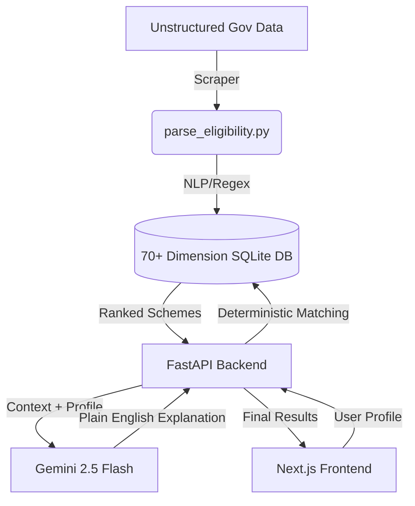

<div align="center">
  <h1>🇮🇳 Suvidha Setu (सुविधा सेतु)</h1>
  <p><b>India has 4,669 welfare schemes. Millions still get nothing. We fixed the discovery problem.</b></p>
  <p>A precision recommender engine and AI assistant for India's government welfare schemes.</p>
</div>

<p align="center">
  
  
  
  
  
</p>

---

## 🛑 The Problem
The official government portal acts as a "document dump," returning 500–3,000 schemes for a single query using flat filters. It trusts vulnerable citizens to read through hundreds of complex, bureaucratic PDFs to find out if they qualify.

## 💡 The Solution
Suvidha Setu replaces the search bar with a **precision matching engine**. 
1. **Dynamic Questionnaire:** Asks 8-16 branching questions to prune the noise.
2. **Deterministic Engine:** Cross-references answers against a 70+ dimension strict SQLite database.
3. **AI Explanation Layer:** Uses **Saarthi** (powered by Gemini 2.5) to translate bureaucratic jargon into plain, actionable vernacular language.

**We didn't build another chatbot. We rebuilt welfare discovery from first principles.**

---

## 🚀 Key Features

- **70-Dimension Parsing Engine:** A custom Python pipeline that parses 4,669 unstructured government schemes into strict deterministic flags (e.g., extracting exact income caps, age limits, caste requirements).
- **Zero-Hallucination Filtering:** We let code do the math. Welfare eligibility is strict boolean logic, so we use deterministic filtering instead of pure vector search.
- **Saarthi AI Assistant:** AI does the talking. Saarthi translates dense policy jargon, explains exactly *why* you qualify, and lists the exact documents you need.
- **Hyper-Specific Discovery:** Unlocks 86+ hidden schemes for micro-demographics (e.g., sanitation workers' children, acid attack survivors) that broad portals completely miss.
- **Privacy-First:** 100% stateless architecture. No user profiles or sensitive data are stored on the server.
- **Benefit Extraction:** Runs a 4-pass regex engine to extract the exact monetary benefit (e.g., "₹5,000/month") so users know immediately what they get.

---

## 🏗️ Architecture



---

## 💻 Tech Stack

- **Frontend:** Next.js (React), Tailwind CSS
- **Backend:** Python, FastAPI, Uvicorn
- **Database:** SQLite (WAL mode for fast concurrent reads)
- **AI/LLM:** Google Gemini 2.5 Flash (`google-generativeai`)
- **Package Manager:** `uv` (Python), `npm` (Node.js)

---

## 🛠️ Local Development Setup

### Prerequisites
- [Node.js](https://nodejs.org/) (v18+)
- [Python 3.12](https://www.python.org/)
- [`uv`](https://github.com/astral-sh/uv) (Fast Python package installer)

### 1. Setup the Backend (FastAPI)

```bash
# Clone the repository
git clone https://github.com/yourusername/SuvidhaSetu.git
cd SuvidhaSetu

# Create virtual environment and install dependencies
uv venv .venv --python 3.12
uv sync

# Generate the structured scheme database (one-time setup)
uv run python recommender/parse_eligibility.py

# Set up your environment variables
cp .env.example .env
# Edit .env and add your GEMINI_API_KEY

# Start the FastAPI server (Windows: .venv\Scripts\uvicorn, Mac/Linux: .venv/bin/uvicorn)
.venv/Scripts/uvicorn api.main:app --reload --port 8000
```
*(The backend will be running at `http://localhost:8000`)*

### 2. Setup the Frontend (Next.js)

Open a new terminal window:

```bash
cd web

# Install dependencies
npm install

# Set up environment variables
cp .env.example .env.local
# Ensure BACKEND_API_URL=http://localhost:8000 is set in .env.local

# Start the development server
npm run dev
```
*(The frontend will be running at `http://localhost:3000`)*

---

## 🧠 Why We Rejected RAG
LLMs hallucinate numbers. A vector database might match a user making ₹3 Lakhs/year to a scheme requiring < ₹2.5 Lakhs/year simply because the text is semantically similar. Welfare eligibility is binary—you either qualify or you don't. We built a deterministic engine for the filtering to ensure 100% accuracy, and we use Gemini 2.5 strictly as an explanation layer for translating the jargon and guiding the user. 

---

## 📊 Impact Metrics
- **4,669** total schemes analyzed.
- **70+** parsed eligibility dimensions per scheme.
- **3,250+** exact monetary benefits extracted.
- **Under 3 minutes** average discovery time (down from hours of reading PDFs).

---

## 🤝 Contributing
Contributions are highly welcome! Please refer to the `web/README.md` for specific frontend contribution guidelines.

1. Fork the repository
2. Create your feature branch (`git checkout -b feature/AmazingFeature`)
3. Commit your changes (`git commit -m 'Add some AmazingFeature'`)
4. Push to the branch (`git push origin feature/AmazingFeature`)
5. Open a Pull Request

---

## ⚠️ Disclaimer
Suvidha Setu is an independent, informational civic-tech tool. It is **not affiliated with, endorsed by, or operated by the Government of India**. Scheme data is sourced from public portals and may not reflect real-time policy changes. Always verify details on the official government websites.

## 📄 License
This project is open-source under the MIT License.
